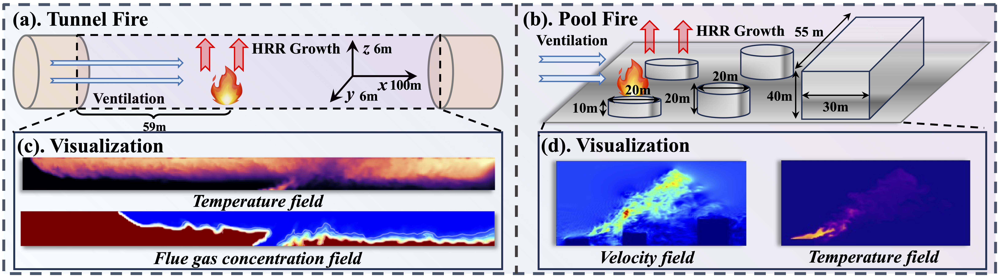

<p align="center" width="100%">
  
</p>


# Prometheus: Out-of-distribution Fluid Dynamics Modeling with Disentangled Graph ODE


<p align="left">
<a href="https://arxiv.org/abs/2306.11249" alt="arXiv">
    </a>
<a href="https://github.com/chengtan9907/OpenSTL/blob/master/LICENSE" alt="license">
    </a>
<!-- <a href="https://huggingface.co/OpenSTL" alt="Huggingface">
    </a> -->
<a href="https://openstl.readthedocs.io/en/latest/" alt="docs">
    </a>
<a href="https://github.com/chengtan9907/OpenSTL/issues" alt="docs">
    </a>
<a href="https://github.com/chengtan9907/OpenSTL/issues" alt="resolution">
    </a>
<a href="https://img.shields.io/github/stars/chengtan9907/OpenSTL" alt="arXiv">
    </a>
</p>


[📘Documentation](https://openstl.readthedocs.io/en/latest/) |
[🛠️Installation](docs/en/install.md) |
[🚀Model Zoo](docs/en/model_zoos/video_benchmarks.md) |
[🤗Huggingface](https://huggingface.co/OpenSTL) |
[👀Visualization](docs/en/visualization/video_visualization.md) |
[🆕News](docs/en/changelog.md)


## Abstract

Fluid dynamics modeling has received extensive attention in the machine learning community. Although numerous graph neural network (GNN) approaches have been proposed for this problem, the issue of out-of-distribution (OOD) generalization remains underexplored. In this work, we introduce a new large-scale dataset, Prometheus, which simulates tunnel and pool fires across various environmental conditions and establishes an extensive benchmark of 12 baselines. These demonstrate that the OOD generalization performance is far from satisfactory. To address this challenge, this paper introduces a novel approach named Disentangled Graph ODE (DGODE), which learns disentangled representations for continuous interacting dynamics modeling. Specifically, we employ a temporal GNN and a frequency network to extract semantics from historical trajectories into node representations and environment representations, respectively. To mitigate potential distribution shifts, we minimize the mutual information between invariant node representations and the discretized environment features using adversarial learning. These components are then integrated into a coupled graph ODE framework, which models the evolution using neighboring nodes and dynamic environmental context. Additionally, we enhance the stability of the framework by perturbing the environment features to improve robustness. Extensive experiments validate the effectiveness of DGODE compared with state-of-the-art approaches.


## Benchmark

**a. Tunnel Design:** A tunnel that is 100 m long, 6 m wide, and 6 m high, with a focus on 2D flow data at y=3 m. Sensors are used to monitor temperature and visibility. **b. Industrial Park Tanks:** Features three tanks, each with a diameter of 20 m and varying heights of 10 m, 20 m, and an adjacent building measuring 55 m in length, 40 m in width, and 30 m in height. **c. Tunnel Visualization:** Displays the distribution of temperature and visibility within the tunnel. **d. Fire Dynamics:** Visualizes both the velocity and temperature in a pool fire to analyze its dynamics.

<p align="center" width="100%">
  
</p>

<p align="center" width="100%">
  
</p>


## Prometheus benchmark download


## Visualization


## Get Started
1. Install Python 3.8. For convenience, execute the following command.

```bash
pip install -r requirements.txt
```

2. Prepare Data. You can obtain experimental datasets from the following links.


| Dataset       | Task                                    | Geometry        | Link                                                         |
| ------------- | --------------------------------------- | --------------- | ------------------------------------------------------------ |
| Navier-Stokes | Predict future fluid velocity           | Regular Grid    | [[Google Cloud]](https://drive.google.com/drive/folders/1UnbQh2WWc6knEHbLn-ZaXrKUZhp7pjt-) |
| WeathBench    | Weather forecasts                       | Regular Grid    | [[Google Cloud]]([https://drive.google.com/drive/folders/1UnbQh2WWc6knEHbLn-ZaXrKUZhp7pjt-](https://drive.google.com/drive/folders/1sPCg8nMuDa0bAWsHPwskKkPOzaVcBneD)) |


## Citation

If you are interested in our repository or our paper, please cite the following paper:

```
@inproceedings{wu2024prometheus,
  title={Prometheus: Out-of-distribution Fluid Dynamics Modeling with Disentangled Graph ODE},
  author={Wu, Hao and Wang, Huiyuan and Wang, Kun and Wang, Weiyan and Ye, Changan and Tao, Yangyu and Chen, Chong and Hua, Xian-Sheng and Luo, Xiao},
  booktitle={Proceedings of the 41st International Conference on Machine Learning},
  pages={PMLR 235},
  year={2024},
  organization={PMLR},
  address={Vienna, Austria}
}
```
